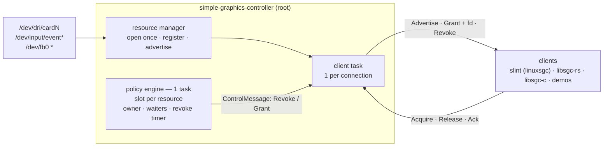

# simple-graphics-controller

Resource daemon for the **sgc** stack: owns the board's graphics/input devices
as root and leases them to clients over the abstract Unix socket `@sgc`.
Clients get a fresh kernel **lease** (DRM — never master) or a dup of the
daemon's fd (input/fbdev); the daemon can always take the resource back.

This repo ships **only the daemon** — wire protocol, client libs and demos
live in sibling repos (see [Ecosystem](#ecosystem)).

## Architecture



- **Open once, hold forever** — grants are dups of the daemon's fd
  (fbdev/input) or *fresh kernel leases* created per grant (DRM); the master
  fd never leaves the daemon.
- **One policy engine arbitrates everything** — Drm, Fbdev and Input alike:
  grant, or queue with owner preemption, or deny. No exceptions.
- **Ask-first revoke** — the wire `Revoke` is a request; the owner's
  `Release` is the ack, then it is requeued for one more turn. A silent owner
  is force-reclaimed after 5 s (no requeue). For DRM the kernel `revoke` runs
  at the handoff, so a revoked client keeps a valid lease through the grace
  window and can finish its frame.

## Backends — compile-time features

| backend | device | grant | feature |
| --- | --- | --- | --- |
| drm | `/dev/dri/cardN` (display-capable, connected first) | fresh kernel lease | `drm` — default |
| input | `/dev/input/event*` (mouse/keyboard/touch, per-class index) | dup fd | `input` — default |
| fbdev | `/dev/fb0` (legacy path) | dup fd | `fbdev` — opt-in |

A build without a backend never advertises it, and `Acquire` against it is
denied "not registered".

## Limitations

- **No input hot-plug** — devices are enumerated once at startup; restart
  the daemon after attaching devices.

## Policies — `SGC_POLICY`

| policy | newcomer when the resource is held | waiters served |
| --- | --- | --- |
| `first-owner` | denied (kiosk/locked-down) | — |
| `latest-owner` | preempts the owner ("bring to front") | newest first |
| `fair-queue` (default) | preempts the owner | oldest first |

## Build & run

```sh
just                          # release build (drm + input), or:
cargo build --release
just build-gnu-aarch64        # board: gnu dynamic
just build-musl-aarch64       # board: fully static musl
just dist-gnu-aarch64         # + strip into ./dist
just deb-gnu-aarch64          # cargo-deb board package
```

Run as **root** (it opens `/dev/dri` + `/dev/input`):

```sh
RUST_LOG=info ./target/release/simple-graphics-controller
```

Tests (policy units, engine actor, full wire e2e over a real abstract
socket): `cargo test`.

## Docs

- [docs/policy-engine.md](docs/policy-engine.md) — arbitration flow: slot
  state machine, preemption handoff, the three policies step by step
- [docs/resource-manager.md](docs/resource-manager.md) — backends, feature
  gating, registries, DRM lease state machine, revoke handoff

## Ecosystem

| repo | holds |
| --- | --- |
| simple-graphics-protocol | wire contract (msgpack + `SCM_RIGHTS`) |
| libsgc-rs | Rust client (pump-based) |
| libsgc-c | C ABI + C++ wrapper, `libsgc.a`/`.so` |
| sgc-demos | standalone demo clients |
| slint | fork with the `linuxsgc` backend (lease-or-die session) |

All cross-repo deps are git refs; no workspace spans repos.

<sub>* `/dev/fb0` only when built with `--features fbdev`.</sub>
