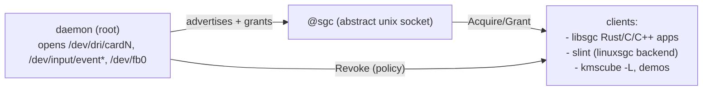

# simple-graphics-controller (daemon)

The resource controller for the sgc ecosystem: owns Linux graphics/input
devices and leases them to clients over the abstract socket `@sgc`. This repo
ships **only the daemon** — the wire contract, client libraries and demos
live in sibling repos (see "Ecosystem" below).

## What it does



- Owns device fds; grants are dups (DRM: a fresh **lease**, never master).
- One **policy engine** arbitrates every resource (Drm, Fbdev, Input alike —
  no exceptions): grant / queue with owner preemption / deny
  (`SGC_POLICY=first-owner|latest-owner|fair-queue`, default fair-queue).
- Ask-first preemption with a 5 s grace window; the holder's `Release`
  doubles as the revoke-ack, the preempted owner is requeued.
- Backends are cargo features, exclusive per build:

| backend | resource | feature |
| --- | --- | --- |
| drm | `/dev/dri/cardN` with a display connector → lease | `drm` (default) |
| input | `/dev/input/event*`, classified keyboard/mouse/touch | `input` (default) |
| fbdev | `/dev/fb0` (legacy; board fb0 = sun4i drmfb) | `fbdev` (opt-in) |

Input devices are enumerated **once at startup** — no hot-plug; restart the
daemon after attaching devices.

## Build & run

```sh
just                       # host dynamic release (workspace)
just build-gnu-aarch64     # board: gnu dynamic   (sets pkg env + ALL_STATIC)
just build-musl-aarch64    # board: fully static musl
just dist-gnu-aarch64      # + strip + copy into ./dist
just deb-gnu-aarch64       # cargo-deb board package (./target/debian)
```

Run: `./simple-graphics-controller` (default = drm + input). Log level via
`RUST_LOG` (info | debug | trace); policy via `SGC_POLICY`. Board deploy:
`scp dist/simple-graphics-controller root@10.21.50.53:/root/` then run as
root (it must open /dev/dri + /dev/input). Full build/deploy recipes and
pitfalls: `~/Projects/sgc/docs/build-guide.md`.

## Internals (this repo's design docs)

- [resource-manager.md](resource-manager.md) — backend features, registries,
  DRM lease state machine, device classification
- [policy-engine.md](policy-engine.md) — the windowing policy engine:
  per-resource slots, waiter queues, preemption + timeouts

## Ecosystem (sibling repos)

| repo | holds | docs |
| --- | --- | --- |
| simple-graphics-protocol | the wire contract crate (msgpack + SCM_RIGHTS) | `docs/PROTOCOL.md` |
| libsgc-rs | Rust client core (pump-based) | `docs/libsgc.md` |
| libsgc-c | C ABI (`libsgc.h`) + C++ wrapper (`sgc.hpp`), `libsgc.a/.so` | — |
| sgc-demos | standalone demo clients (rust + C/C++ meson samples) | per-project README/Justfile |
| slint | fork with the linuxsgc backend + demos | `internal/backends/linuxsgc/docs/` |

All cross-repo dependencies are git refs; no workspace spans repos.
