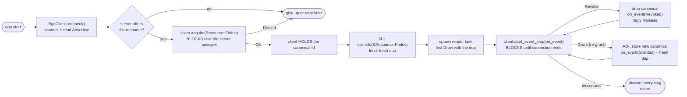

# libsgc-rs — client library design

Rust client library for `simple-graphics-controller` (`@sgc`). Apps link the
crate and drive a `SgcClient`: a synchronous wrapper over the socket — one
struct, two fields, driven by ONE app thread.

The client OWNS the granted fds (one canonical per resource) and LENDS dups to
the app; the canonical is dropped on revoke or disconnect, so the library
cannot leak a resource the app forgot about.

Validated end-to-end in the `sgc-fbdev-client` and `sgc-fbdev-client-2` demos
(same architecture, different scenes), both linked against this crate:
connect, acquire, full preemption cycle on host + aarch64 board with a real
`/dev/fb0`.

## Single-threaded by design

The app thread is always on the socket when it matters: blocked in
`acquire()` it is not the owner yet (the server only revokes owners), and
blocked in `start_event_loop()` it is always listening, so the server's 5s
revoke/ack deadlines are met. An app that must do other work while holding the
resource runs the client on its own thread — like the demo's main thread next
to the render thread.

Contract: while holding the resource, the client's thread must stay in the
event loop.

## Client-ownership model

The client is the source of truth for resource ownership: it holds the granted
fds and lends them out. The app never touches the canonical fd.

### API

    pub struct SgcClient {
        stream: UnixStream,
        held: HashMap<Resource, OwnedFd>,   // canonical fds, client-owned
    }

    impl SgcClient {
        pub fn connect() -> Result<(Self, Vec<Resource>), SgcError>;
            // connect + read Advertise; the advertised list lets the app
            // fail fast ("server does not offer the resource") without a
            // Deny round trip.
        pub fn acquire(&mut self, resource: Resource) -> Result<(), SgcError>;
            // write Acquire -> read Grant -> Ack -> store the canonical in `held`.
            // Deny { reason } -> Err(Denied). Nothing held on error. The fd
            // is NOT returned — the client keeps it.
        pub fn fd(&self, resource: &Resource) -> Result<OwnedFd, SgcError>;
            // LEND: fresh dup (try_clone) of the held fd. Err(NotHeld) if not held.
        pub fn held(&self) -> Vec<Resource>;
            // what this session holds.
        pub fn start_event_loop<F>(&mut self, on_event: F)
        where
            F: FnMut(SgcEvent);
            // BLOCKING loop on the app thread until the connection ends.
    }

    pub enum SgcEvent {                       // resource-tagged for multi-resource apps
        Revoked { resource: Resource },       // stop drawing, drop the dup
        Granted { resource: Resource, fd: OwnedFd },  // fresh dup, draw
    }

### Event-loop semantics

- `Revoke { resource }` -> drop the canonical from `held`, emit `Revoked`,
  reply `Release` (the revoke-ack; the server waits <=5s, then
  force-reclaims and does NOT requeue).
- `Grant { resource }` (unsolicited re-grant) -> `Ack` it (5s server timer),
  store the new canonical, emit `Granted` with a fresh dup — no `acquire`
  needed.
- Disconnect (EOF/error) -> disown everything (drop canonicals, emit
  `Revoked` per held resource), return.

Re-grant is a wire `Grant` handled in the event loop, not an `acquire()`
result; `acquire()` is only for startup requests.

### Why it is sound

1. **The canonical never leaves the client.** `fd()` always dups — two owners
   of the same `OwnedFd` are impossible by construction; no double close.
2. **Borrowers own their dups.** The borrower drops its dup on `Revoked`; the
   client drops the canonical at the same time — both refer to the same file
   description.
3. **Revoke reaches the borrower.** `Revoked` is resource-tagged; the tag is
   the routing key for per-resource renderers.
4. **Cleanup is guaranteed.** Disconnect disowns everything — no leaked
   resource.

### App-side mapping

The library maps wire messages to `SgcEvent`; the app maps `SgcEvent` to its
own commands (the demos' tagged `RenderCmd`):

    client.start_event_loop(|event| match event {
        SgcEvent::Revoked { resource } => { let _ = render_tx.send(RenderCmd::Stop { resource }); }
        SgcEvent::Granted { resource, fd } => { let _ = render_tx.send(RenderCmd::Draw { resource, fd }); }
    });

## Usage model (the app's view)



`acquire()` BLOCKS until the outcome is known; queued requests are
indistinguishable from immediate grants — the point. The fd for drawing always
comes from a lend (`fd()`) or a `Granted` event, never from `acquire()`.

## App structure (the demos)

- main thread: connect → check advertised resources → acquire the display
  (blocking) → lend a dup → spawn render task → first `Draw` with the dup →
  acquire the first advertised mouse (one resource per message) → lend a dup
  → spawn input task → `start_event_loop` mapping `SgcEvent` → `RenderCmd` /
  `InputCmd` by resource → send `Stop`/`Exit`, drop senders, join.
- render task: receives `RenderCmd` on an mpsc channel; builds the renderer
  from the first `Draw` fd (linfb is `!Send`, so it must be built there); owns
  its dup (drops it on `Stop`); redraws its cached scene on every `Draw`.
- input task: receives `InputCmd` on an mpsc channel; watches the granted
  mouse fd — a dup of the server's open of `/dev/input/eventN`, so events are
  parsed straight off the fd (native-endian, no EVIOCGRAB — input is
  broadcast to every open fd, shared visibility is the point); drops its dup
  on `Stop`.
- The demos render until killed: no `--hold`, no graceful release — the server
  frees the resource on disconnect.
- `sgc-fbdev-client`: bouncing-rect scene; main + `logic` + `render` +
  `timer` (16ms logic / 33ms draw timers on one loop; `RenderCmd` adds
  `Exit`) + `input` (evdev mouse watcher).
- `sgc-fbdev-client-2`: checkerboard scene; main + `render`.

## Renderer constraints (linfb)

- `Compositor` is `!Send` (holds `Box<dyn Shape>`) — build the Renderer inside
  the render task, not in main.
- `Framebuffer::open_with_fd` takes ownership of the fd — hand it a dup
  (`OwnedFd::try_clone`); the canonical stays with the client.
- Create the Renderer once and KEEP it across revokes: the fbdev mmap stays
  valid after the fd closes (mmap holds the file description), so a
  revoke/regrant cycle just redraws.
- Opening (ioctls + mmap) and building the scene (fonts) are the expensive
  parts — hence exactly once; redrawing the static compositor is draw + flush.

## Wire mechanics

- Every read is recvmsg (`sendfd::RecvWithFd`), header included — fds attach
  to the first bytes of a Grant frame; a plain read silently discards them.
- SCM_RIGHTS fds -> `unsafe { OwnedFd::from_raw_fd(fd) }` (sound: ownership
  transfers; no safe `TryFrom<RawFd>` exists).
- Ack after every Grant (initial and regrant — the server arms a 5s ack timer
  each time). Release on Revoke is the revoke-ack.
- Regrant arrives unsolicited — normal preemption handoff; just Ack and hand
  the fd on.

## Error mapping

`SgcError` (thiserror, 7 variants):

| site | variant |
| ---- | ------- |
| connect: no server / refused | `ConnectFailed(io)` |
| connect: bad frame / non-`Advertise` first message | `Protocol` / `UnexpectedMessage` |
| fail-fast: resource not offered | `NotAvailable { resource }` |
| acquire: server deny | `Denied { reason }` |
| acquire: grant without exactly 1 fd | `Io(InvalidData)` |
| acquire/event loop: wire failure | `Io` |
| any: frame decode | `Protocol` |
| `fd()` of a resource not held | `NotHeld { resource }` |

EOF inside the event loop is normal teardown, not an app-facing error.

## Testing

- 4 unit tests in `libsgc-rs/src/client.rs` against a fake controller on an
  abstract socket: no-server connect, Advertise read, Deny surfaces reason,
  Grant stores canonical + lends dup (real SCM_RIGHTS). Run:
  `cargo test -p libsgc-rs`.
- Board validation (aarch64, real `/dev/fb0`):

```
A: granted -> held: [Fbdev] -> drawing
B preempts -> A: revoked -> stopped
B dies     -> A: re-granted -> drawing (fresh dup)
```

`held` matched the true state at every step; no fd leaks, no double close.

- Open: real-daemon test matrix on a test socket (needs `SGC_SOCKET` +
  `SGC_FBDEV_PATH` server knobs).

## Open items

- `release()` (voluntary hand-back) not implemented: check `held`, write
  `Release`, remove from `held` when it lands.
- Multi-resource acquisition is one at a time — the protocol names exactly
  one resource per message by design; `HashMap` + tagged events are the
  routing for apps that hold several resources.

## Non-goals (v1)

- Multi-resource `acquire` (one resource per message by design).
- Acquire timeout (a one-liner later — the reply is a direct read).
- Non-blocking `acquire` (run the client on a worker thread instead).
- Reconnect logic (session dies loudly; the app reconnects).
- C client library (LVGL) — later crate; wire spec in `docs/PROTOCOL.md`.
