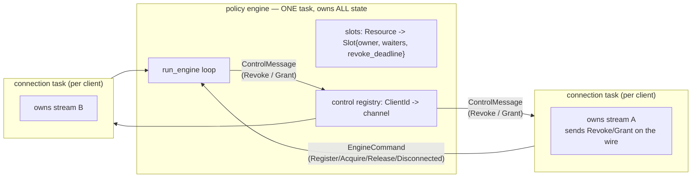
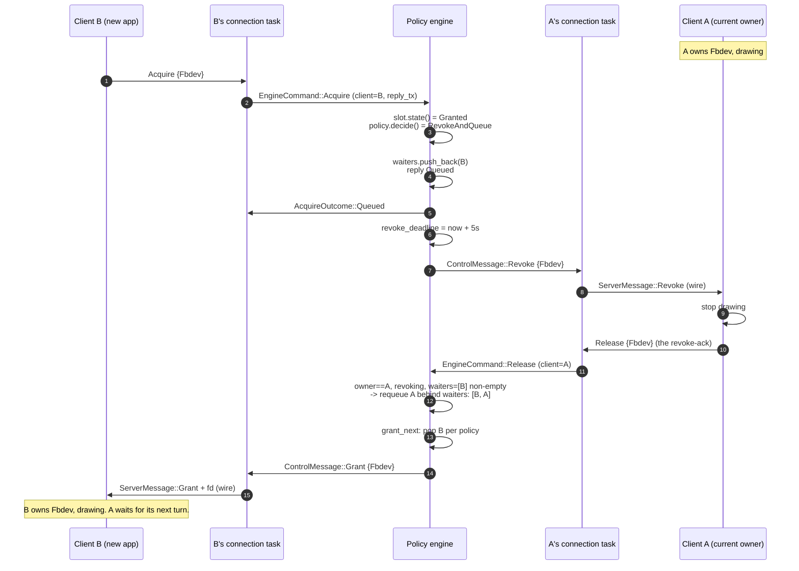
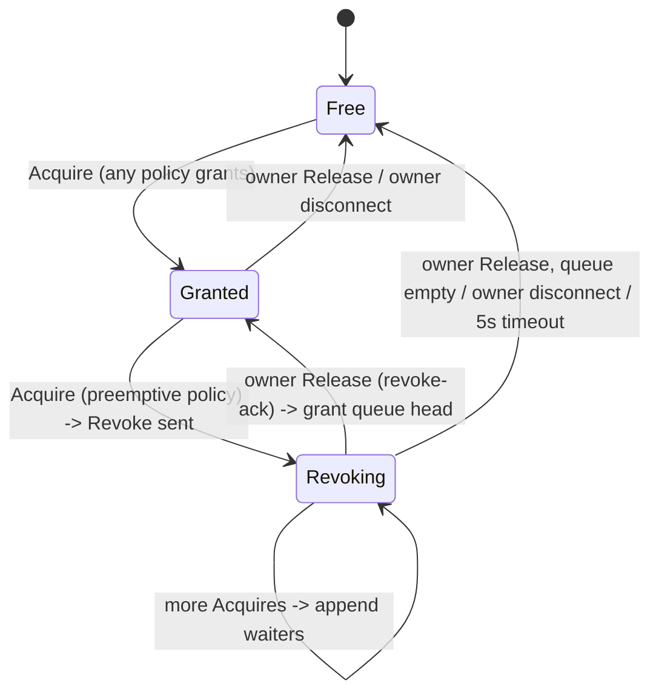
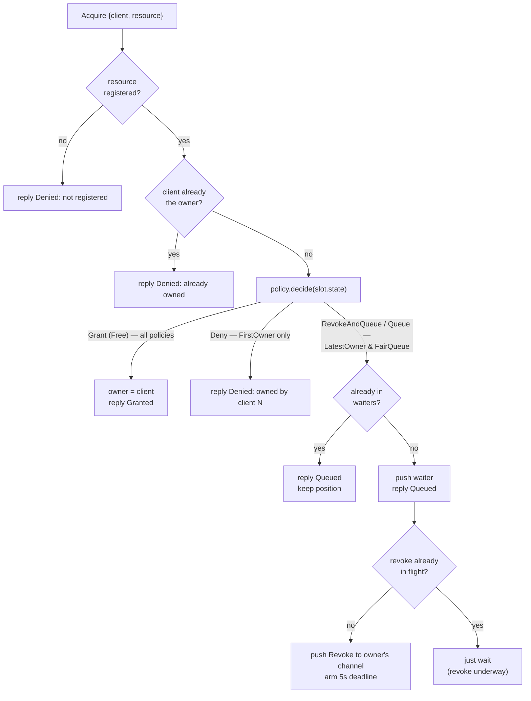
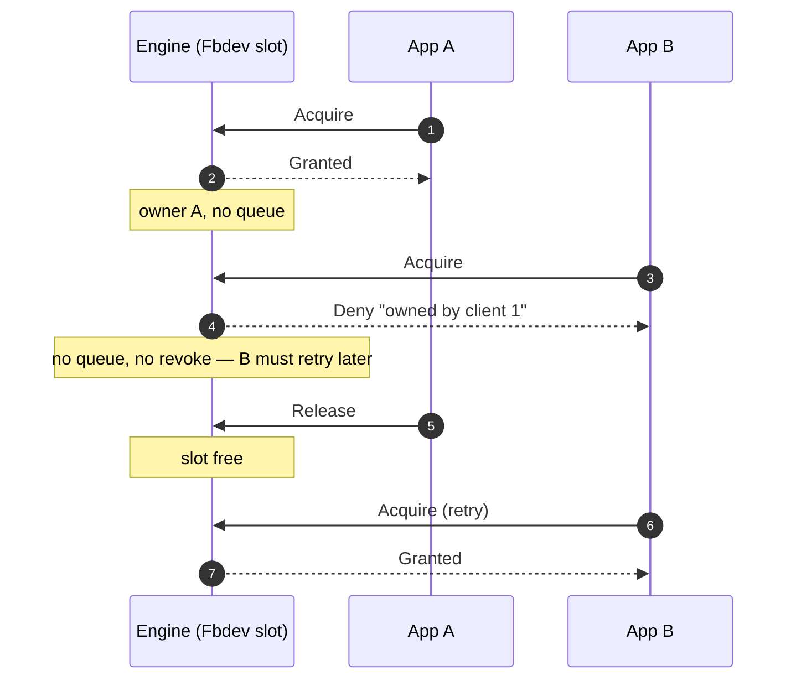
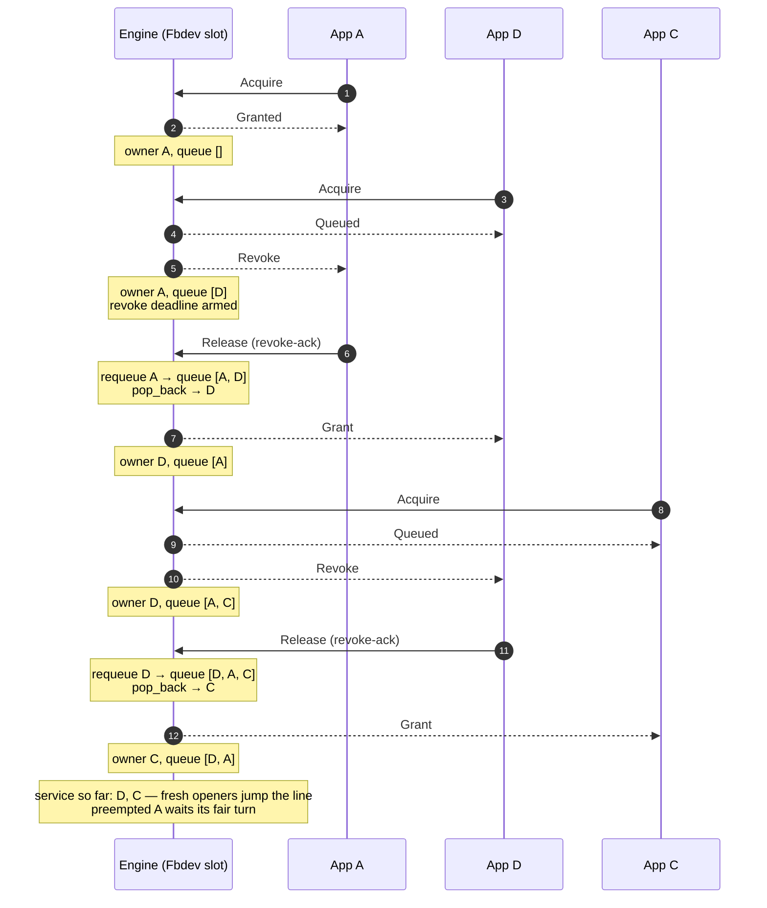
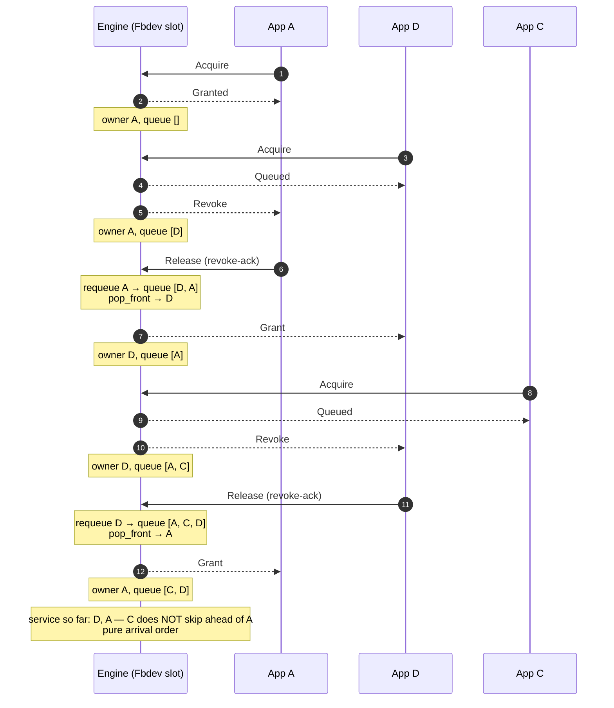

# Policy engine — flow and architecture

How the `simple-graphics-controller` policy engine works: the mechanism that
arbitrates resource ownership (revoke handshake, waiter queues, timeouts),
with the policies that decide who wins.

Source: `simple-graphics-controller/src/windowing.rs` — `Policy`,
`PolicyEngine`, `Slot`, `handle_command`, `grant_next`, `force_reclaim`.
Policies are `FirstOwner` (first acquirer keeps it, others denied),
`LatestOwner` (newest acquirer preempts; waiters served newest-first) and
`FairQueue` (newest acquirer preempts; waiters served oldest-first).

## Big picture — three moving parts

Each client connection is a tokio task that owns its stream. The engine is a
single task that owns all shared state. They never share memory — they talk
through two channels:

- connection task -> engine: `EngineCommand` (Register, Acquire with reply,
  Release, Disconnected)
- engine -> connection task: `ControlMessage` (Revoke, Grant) via a
  per-connection control channel the task registered at connect

Why this split: the engine decides WHO gets the resource but never writes to
a socket. When it wants A evicted, it pushes `Revoke` into A's control
channel; A's task writes it on A's stream. When a queued client wins, the
engine pushes `Grant`; that task attaches the fd (from `ResourceRegistry`)
and sends it. The engine is a pure decision machine — no I/O, no locks, no
TOCTOU, because one task = one owner of the state.

## The main handoff (preemption flow)

Walkthrough (all in `handle_command` unless noted):

1. B's task calls `engine.acquire(B, Fbdev)` — sends an Acquire command with
   a oneshot reply channel.
2. Engine checks: resource registered? already B's? Then
   `policy.decide(state)`: Fbdev is Granted to A and the policy is
   preemptive -> `RevokeAndQueue`.
3. Engine pushes `Waiter{B}` to the queue, replies "Queued" to B's task
   (reply first, eviction second — B knows its status before A is told to
   leave), then pushes `ControlMessage::Revoke` into A's control channel and
   arms `revoke_deadline = now + 5s`.
4. A's task writes `Revoke` on the wire. A's client stops drawing and sends
   `Release` — that Release is the revoke acknowledgment.
5. Release handler: owner == A, a revoke is in flight, and waiters are
   non-empty -> requeue A at the served-last position, so the queue is
   `[B, A]`. Then `grant_next` pops B per policy (FIFO front / LIFO back),
   sets owner = B, pushes `Grant` into B's control channel.
6. B's task writes `Grant` + fd on the wire. B draws. A sits in the queue
   for one more turn.
7. If A never releases: the `run_engine` loop's `timeout_at` fires and
   `force_reclaim` frees the slot and grants B anyway — A is NOT requeued
   (wedged clients don't get queue spots).

## Slot state machine (per resource)

A slot is in exactly one of three states (`SlotState`):

- `Free` — no owner. Next Acquire -> Grant (all policies).
- `Granted` — owner set, no revoke pending.
- `Revoking` — owner set AND `revoke_deadline` set (Revoke sent, awaiting
  its Release). More Acquires just append waiters.

The state is DERIVED, not stored: `Slot::state()` computes it from
`(owner, revoke_deadline)`. That way the three fields can never contradict
each other — one source of truth.

The `run_engine` loop sleeps until the EARLIEST `revoke_deadline` across all
slots (`timeout_at`), so a silent owner is force-reclaimed even while no
other command arrives. No per-waiter timers, no busy polling.

## Acquire decision flow

Where the policies differ in this chart: only at `policy.decide` — FirstOwner
takes Deny, the two preemptive policies take the queue path. Everything
before F (registered? already owner?) is policy-agnostic engine logic, and
LatestOwner vs FairQueue are IDENTICAL from F down: their difference lives
in the FREE path (which waiter `grant_next` pops — pop_back vs pop_front —
and where the requeue lands), not in the Acquire path at all.

Notes on the preemptive path:

- B's "Queued" reply is sent BEFORE the Revoke is pushed to A, so the
  newcomer knows it is in the queue before the incumbent is even told to
  leave.
- The "first waiter starts the revoke" rule means only one Revoke is ever in
  flight per resource, no matter how many apps pile up behind.

## The three policies, step by step

Quick reference (what each policy does at each slot state, and how it
manipulates the queue):

| Policy      | Free      | Granted        | Revoking | pop_waiter | requeue    |
| ----------- | --------- | -------------- | -------- | ---------- | ---------- |
| FirstOwner  | Grant     | Deny           | Deny     | never      | no-op      |
| LatestOwner | Grant     | RevokeAndQueue | Queue    | pop_back   | push_front |
| FairQueue   | Grant     | RevokeAndQueue | Queue    | pop_front  | push_back  |

### FirstOwner — first acquirer keeps it, others denied

No preemption, no queue, no requeue. The slot oscillates Free <-> Granted.

| Step | Action            | owner | waiters | result                          |
| ---- | ----------------- | ----- | ------- | ------------------------------- |
| 1    | A Acquire         | A     | —       | Granted                         |
| 2    | B Acquire         | A     | —       | Deny: "Fbdev is owned by client 1" |
| 3    | D Acquire         | A     | —       | Deny                            |
| 4    | C Acquire         | A     | —       | Deny                            |
| 5    | A Release         | —     | —       | Free                            |
| 6    | B Acquire (retry) | B     | —       | Granted                         |

Use for: kiosk apps, boot splash, diagnostic overlays — resources that must
never be stolen mid-session. Denied clients must retry (there is no queue).

### LatestOwner — newest opener wins; preempted apps queue fairly

`pop_waiter` pops the back (newest first); `requeue_waiter` pushes the front
(served last). Result: a FRESH Acquire jumps the whole line, while apps that
were preempted are served among themselves in requeue order (FIFO).

| Step | Action                       | owner | waiters (front → back) | result                        |
| ---- | ---------------------------- | ----- | ---------------------- | ----------------------------- |
| 1    | A Acquire                    | A     | —                      | Granted                       |
| 2    | D Acquire                    | A     | D                      | Queued; Revoke -> A; deadline |
| 3    | A Release (revoke-ack)       | D     | A                      | A requeued (front), pop_back -> D Granted |
| 4    | C Acquire                    | D     | A, C                   | Queued; Revoke -> D           |
| 5    | D Release (revoke-ack)       | C     | D, A                   | D requeued (front), pop_back -> C Granted |
| 6    | B Acquire                    | C     | D, A, B                | Queued; Revoke -> C           |
| 7    | C Release (revoke-ack)       | B     | C, D, A                | C requeued (front), pop_back -> B Granted |
| 8    | B Release (done, no requeue) | A     | C, D                   | pop_back -> A Granted         |
| 9    | A Release                    | D     | C                      | pop_back -> D Granted         |
| 10   | D Release                    | C     | —                      | pop_back -> C Granted         |

Service order: D, C, B, A, D, C — every new opener (D, C, B) preempted and
took the screen in opening order; the preempted apps then got their turns in
requeue order (A before D before C).

Use for: "bring to front" UX — a newly opened app always lands on screen
immediately. Subtle property: because every fresh opener jumps the queue,
the queue's main job is giving preempted apps their one-more-turn fairly.

### FairQueue — newest opener preempts, oldest waiter served first

`pop_waiter` pops the front (oldest first); `requeue_waiter` pushes the back
(served last). Strict arrival order: a fresh opener joins the BACK of the
line like everyone else.

| Step | Action                       | owner | waiters (front → back) | result                        |
| ---- | ---------------------------- | ----- | ---------------------- | ----------------------------- |
| 1    | A Acquire                    | A     | —                      | Granted                       |
| 2    | D Acquire                    | A     | D                      | Queued; Revoke -> A; deadline |
| 3    | A Release (revoke-ack)       | D     | A                      | A requeued (back), pop_front -> D Granted |
| 4    | C Acquire                    | D     | A, C                   | Queued; Revoke -> D           |
| 5    | D Release (revoke-ack)       | A     | C, D                   | D requeued (back), pop_front -> A Granted |
| 6    | B Acquire                    | A     | C, D, B                | Queued; Revoke -> A           |
| 7    | A Release (revoke-ack)       | C     | D, B, A                | A requeued (back), pop_front -> C Granted |
| 8    | C Release (done, no requeue) | D     | B, A                   | pop_front -> D Granted        |
| 9    | D Release                    | B     | A                      | pop_front -> B Granted        |
| 10   | B Release                    | A     | —                      | pop_front -> A Granted        |

Service order: D, A, C, D, B, A — pure arrival order. Note step 5: C (a
fresh opener) did NOT skip ahead of A (revoked two steps earlier); A's
"one more turn" came first. The revoke still steals the screen from the
current owner, but it never lets anyone cut the line.

Use for: the default — fair handoff when several apps compete for the
screen; no app can starve another by repeatedly opening.

## Failure paths (everything that could wedge the queue)

| Event                          | Engine action                                      |
| ------------------------------ | -------------------------------------------------- |
| Owner silent after Revoke      | 5s deadline -> force reclaim -> grant next, no requeue |
| Owner disconnects mid-revoke   | Disconnected -> free slot -> grant next, no requeue |
| Waiter disconnects while queued| Disconnected -> removed from waiters               |
| Releaser is not the owner      | warn, ignore                                       |
| Orphaned revoke (preemptor(s) gone, owner releases) | plain release — no requeue, slot goes Free |
| Client re-Acquires while queued| dedup: keep position, no second entry              |
| Unregistered resource          | deny "not registered"                              |
| Double acquire by owner        | deny "already owned by this client"                |

## Wire consequences

- `Revoke -> Release` is the handoff; `Release` doubles as the revoke
  acknowledgment. Zero wire protocol changes.
- A `Grant` can arrive with NO preceding `Acquire` — it means "you were
  re-granted after being revoked". Clients keep reading after `Release` and
  resume on `Grant`.
- Under preemptive policies an `Acquire` never fails for "owned" — the
  client blocks until `Grant` or `Deny`. Cancelling = disconnect (dequeues).
  A `CancelAcquire` message is the natural future extension.
- **DRM: the wire `Revoke` is an ask, not a kill.** The kernel
  `revoke_lease()` ioctl runs at the HANDOFF, not when the `Revoke` message
  is written: the evicted client keeps a fully valid lease through the grace
  window (REVOKE_TIMEOUT) so it can finish its frame. The lease is revoked
  on the client's `Release` — or, if it stays silent, by the next grant's
  stale-revoke after force-reclaim. Revoking first would kill the client's
  next modeset ioctl mid-frame on an invalid lease fd. Fbdev/input have no
  kernel revoke at all — cooperative only.

## Future: exclusion groups (fbdev vs drm)

Fbdev and DRM are two access paths to the SAME display — they cannot be
granted at the same time, not even to the same client. When DRM is exposed
(`Resource::Drm` + `/dev/dri/card*` fds registered), the engine's
arbitration unit becomes a GROUP, not a resource:

- group "Display" = { Fbdev, Drm }; invariant: at most one granted, ever.
- `Acquire{drm}` while fbdev is held -> exactly today's preempt path
  (revoke the fbdev holder, queue, grant drm when freed).
- Waiter entries carry the REQUESTED resource — a requeued fbdev holder
  still wants fbdev even if the newcomer asked for drm.
- Grant delivers the fd of the requested resource (both fds live in the
  registry). Distinct variants are REQUIRED: the client must know the fd's
  type to use it (fbdev ioctls vs drmMode*).
- A multi-resource Acquire spanning one group is invalid (mutually
  exclusive) -> denied, no deadlock case to design for.

NOT implemented yet: with `Resource::Drm` exposed, per-resource slots no
longer express that Fbdev and Drm are two access paths to the SAME panel — a
Drm grant while Fbdev is held, or vice versa, must be arbitrated as one
group, not two independent slots. The group is the next step after the
per-backend resource work (see resource-manager.md).
