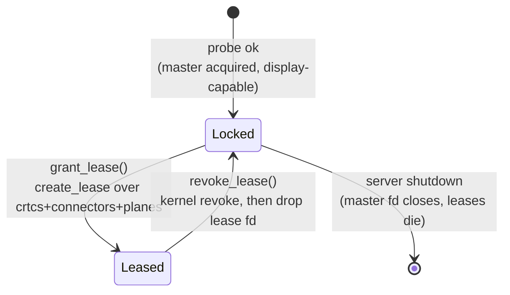

# Resource manager — backends, features, and DRM leases

The daemon's resource layer: how each backend (fbdev, DRM, input) is opened,
registered, granted, and reclaimed — and how backends are selected at build
time.

Source: `simple-graphics-controller/src/resource_manager/`. The arbitration of
*who owns what* is the policy engine ([policy-engine.md](policy-engine.md)),
which is orthogonal: it sees only the advertised resource list and never
touches device nodes. The wire format is specified in the protocol crate's
`docs/PROTOCOL.md` (repo: simple-graphics-protocol).

## Backends are compile-time features

Each backend is an optional Cargo feature. A build includes exactly the
backends it was compiled with; unbuilt backends do not exist in the binary —
no module, no dependency, no `/dev` probing.

| feature | module                    | dependency         | device              | registers                    |
| ------- | ------------------------- | ------------------ | ------------------- | ---------------------------- |
| `fbdev` | `resource_manager::fbdev` | -                  | `/dev/fb0`          | `Resource::Fbdev` in fds     |
| `drm`   | `resource_manager::drm`   | `drm` (optional)   | `/dev/dri/cardN`    | `Resource::Drm { card }` in drm registry |
| `input` | `resource_manager::input` | `evdev` (optional) | `/dev/input/event*` | `Resource::Input(_)` in fds |

Default features: **`drm` + `input`**. `fbdev` is opt-in (legacy path kept
for boards without DRM).

```toml
[features]
default = ["drm", "input"]
fbdev   = []
drm     = ["dep:drm"]
input   = ["dep:evdev"]

[dependencies]
drm   = { version = "0.15", optional = true }
evdev = { version = "0.12", optional = true }
```

`dep:` syntax ties the optional dependency to the feature explicitly — the
`drm` crate is compiled and linked only when the `drm` feature is on, and the
same for `evdev`/`input`.

The protocol crate (`simple-graphics-protocol`) is deliberately **ungated**:
its `Resource` enum always has every variant, because the wire format must not
depend on how the server was built (a client cannot parse messages the server
was compiled unable to send, and vice versa). An unbuilt backend is simply
never *advertised* — the engine builds slots only from the advertised list, so
an `Acquire` for an unbuilt backend is denied with "not registered" exactly
like any other unknown resource. Gating lives at the module/dependency
boundary, never in the wire types.

## Module layout

```
resource_manager/
  mod.rs      ResourceRegistries, query_resource()
  fbdev.rs    #[cfg(feature = "fbdev")]  open fbdev
  drm.rs      #[cfg(feature = "drm")]    DrmCard, DrmDevice, DrmRegistry
  input.rs    #[cfg(feature = "input")]  discovery + classification
```

```rust
/// The server's grant sources, cloned per client connection.
#[derive(Clone)]
pub struct ResourceRegistries {
    /// Static fds for Fbdev and Input — grants are dups of these.
    pub fds: ResourceRegistry,
    /// DRM lease factories — each grant creates a fresh lease fd.
    #[cfg(feature = "drm")]
    pub drm: DrmRegistry,
}
```

`query_resource()` runs only the enabled openers and returns the registries
plus the `advertised` list in priority order (first is best). The advertised
list is the single source of truth for the engine's slots and the policy map
— never registry keys.

## Two registry kinds

- **fds registry** (`Arc<DashMap<Resource, OwnedFd>>`) — fbdev and input.
  The server opens the device once and keeps the fd; a grant is a
  `try_clone()` dup of that fd. The client's fd is the server's fd: same
  semantics, cooperative close.
- **drm registry** (`Arc<DashMap<Resource, DrmDevice>>`) — DRM cards. The
  server's own fd (the master) must never reach a client — it would hand out
  DRM master. Grants are *fresh lease fds*, created by the kernel on demand
  and revoked (kernel-enforced) on reclaim.

## DRM card lifecycle — a type-state machine

A card's usable life is two states, and the type system makes every other
transition unrepresentable:



Cards that fail the probe (no master, no display connector, un-leasable)
never enter the registry — there is no `Available` state in the map, because
an unregistered card is indistinguishable from a skipped one and the engine
denies it. Discovery order *is* advertised priority (connected first, then
lowest index).

```rust
/// Master fd wrapper (O_RDWR | O_CLOEXEC | O_NONBLOCK).
pub struct DrmCard(File);
impl drm::Device for DrmCard {}
impl drm::control::Device for DrmCard {}

/// A live kernel lease: id for revoke, fd for the client (and as a handle
/// that keeps the lease alive while the server holds it).
pub struct DrmLease {
    id: LeaseId,
    fd: OwnedFd,
}

/// Master held, leaseable.
pub struct LockedDrmDevice {
    card: DrmCard,
}

/// Master held + one live lease.
pub struct LeasedDrmDevice {
    card: DrmCard,
    lease: DrmLease,
}

impl LockedDrmDevice {
    /// Query the card's objects fresh and lease them all.
    pub fn create_lease(self) -> Result<LeasedDrmDevice, Self>;
}

impl LeasedDrmDevice {
    /// Kernel revoke; on success drop the lease fd and return to Locked.
    /// On failure return Err(Self) — id and fd are preserved, so the
    /// reclaim can be retried later (never lose the lease on an ioctl error).
    pub fn revoke_lease(self) -> Result<LockedDrmDevice, Self>;
}
```

Consuming transitions that return `Result<Next, Self>` are the point: an
ioctl failure hands back the state you were in, so a card can never be lost
or double-leased — the failure path is a retry, not a leak.

The objects for the lease are queried fresh at `create_lease` time
(`resource_handles()` + `plane_handles()`), not cached: probe-time handles
are used for discovery/ordering only, and the lease always reflects the card
as it is now. (Probing again under the state lock is a few cheap ioctls.)

### Why the state lives behind a Mutex

The engine can push `Revoke` for an owner while a queued client's task is
concurrently running a grant on the same card — two tasks, one `DrmDevice`.
The pure remove/transition/insert dance over a shared map would race. So each
registry entry serializes its transitions:

```rust
pub struct DrmDevice {
    /// Invariant: always Some outside a transition.
    state: Mutex<Option<DrmDeviceState>>,
}

pub enum DrmDeviceState {
    Locked(LockedDrmDevice),
    Leased(LeasedDrmDevice),
}

impl DrmDevice {
    /// Grant path: stale-revoke any previous lease first (the kernel cannot
    /// re-lease the same objects until the old lease dies), then lease.
    pub fn grant_lease(&self) -> io::Result<OwnedFd> {
        let mut guard = self.state.lock().unwrap();
        let current = guard.take().expect("state always present");
        let next = match current {
            DrmDeviceState::Locked(dev) => dev.create_lease(),
            DrmDeviceState::Leased(dev) => match dev.revoke_lease() {
                Ok(dev) => dev.create_lease(),
                Err(dev) => return Err(/* lease could not be reclaimed */),
            },
        };
        match next {
            Ok(dev) => { *guard = Some(DrmDeviceState::Leased(dev)); /* hand a dup of the lease fd */ }
            Err(dev) => { *guard = Some(DrmDeviceState::Locked(dev)); Err(/* create_lease failed */) }
        }
    }

    /// Reclaim path: revoke a live lease; a failed revoke keeps the Leased
    /// state so the next reclaim can retry. No-op when Locked.
    pub fn revoke_lease(&self) {
        let mut guard = self.state.lock().unwrap();
        let current = guard.take().expect("state always present");
        *guard = Some(match current {
            DrmDeviceState::Leased(dev) => match dev.revoke_lease() {
                Ok(dev) => DrmDeviceState::Locked(dev),
                Err(dev) => DrmDeviceState::Leased(dev), // retry next time
            },
            state => state,
        });
    }
}
```

`take()`/`replace()` is the standard "move a value out from behind a Mutex"
idiom; the `Option` is only ever `None` inside a transition. The state lock
is a plain `std::sync::Mutex` — no `await` happens while it is held (lease
ioctls are fast), so the policy engine's async machinery is untouched.

Note the server keeps its copy of the lease fd inside `LeasedDrmDevice` (it
is sent to the client via `SCM_RIGHTS` as a dup, never moved). Consequence:
a client that dies without releasing does *not* free the objects by itself —
its fd closing leaves the server's copy. That is fine and deterministic: the
card is reclaimed on the next reclaim path (see below), and a lingering lease
never blocks a grant, because the grant path stale-revokes first.

## Revoke handoff — ask first, revoke at handoff

Preempting a DRM client is a two-step handoff, and the order matters. If the
server kernel-revoked the lease without warning, the client's next modeset
ioctl would fail mid-frame and it would die on an invalid lease fd before it
could finish drawing or tear down. So the wire `Revoke` is an *ask*, and the
kernel `revoke_lease()` ioctl happens only at the handoff — when the client
releases, or when the grace window expires:

1. Engine decides to preempt owner A for waiter B -> A's task writes
   `ServerMessage::Revoke` on the wire and arms `REVOKE_TIMEOUT` (5s, see
   policy-engine.md). No ioctl yet: A's lease stays fully valid, so A can
   finish its current frame and hand off gracefully.
2. Whichever comes first:
   - **A releases on time**: the revoke ioctl runs at the handoff (a no-op
     if A's fd close already killed the lease — tolerated), the engine
     requeues A for one more turn, and the next waiter is granted.
   - **5s pass with no Release**: the engine force-reclaims the slot; the
     next grant's stale-revoke ioctl kills A's lease on the spot — enforced
     even though A's fd is still open — and creates a fresh lease for B.
     A is NOT requeued (wedged clients don't get queue spots).
3. The next grant always creates a FRESH lease over the card's objects
   (per-grant model); the client never receives a previous client's lease.

| event                         | DRM action                                   | fbdev/input |
| ----------------------------- | -------------------------------------------- | ----------- |
| engine-pushed `Revoke`        | wire `Revoke` only — the ask; lease stays valid for the 5s grace window | wire `Revoke` only (cooperative) |
| client `Release` (on time)    | revoke ioctl at handoff -> requeue releaser -> grant next waiter a fresh lease | drop ownership, requeue |
| 5s deadline, no `Release`     | force-reclaim -> next grant's stale-revoke kills the lease -> fresh lease; no requeue | force-reclaim (no kernel stop) |
| client disconnect             | engine frees ownership; lease lingers (server copy) -> reclaimed by the next grant's stale-revoke | ownership freed |
| grant while a lease is active | stale-revoke inside `grant_lease()` then create | n/a |

A failed `revoke_lease` ioctl keeps the `Leased` state (id + fd preserved),
so the reclaim is retried on the next path that touches the card — the state
machine never throws away the one handle that can still reclaim the objects.

## What this design does not touch

- **Wire protocol**: ungated, unchanged — `Advertise` lists what this build
  actually registered.
- **Policy engine**: slots come from `advertised`; a backend that isn't
  compiled is simply never a slot.
- **Client crates**: `libsgc-rs` and the demo clients talk to the protocol
  crate only; they build identically against any server build.
- **fbdev/input grants**: still plain dups of the server's registered fd;
  the fds registry is untouched.
